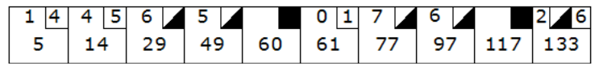
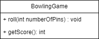

# Einleitung 
Dieses Projekt stellt die Plattform für die Umsetzung des Bowling Game Katas von Robert C. Martin (aka Uncle Bob) dar. Dessen Beschreibung findet sich in seinem [Blog](http://butunclebob.com/ArticleS.UncleBob.TheBowlingGameKata)

# Bowling Punkteverteilung
Ein Spiel besteht aus 10 Runden. In jeder Runde hat der Spieler die Möglichkeit 10 Kegel mit 2 Würfen abzuwerfen. Die Punktezahl einer Runde ergibt sich aus der Summe der mit beiden Würfen umgeworfenen Kegel und eines evtl. Bonuses für Strikes oder Spares.

Ein Spare liegt vor, wenn der Spieler alle 10 Kegel mit den beiden Würfen einer Runde umwirft. In diesem Fall erhält der Spieler einen Bonus in der Höhe der Punkte seines nächsten Wurfs. Dieser Bonus wird natürlich erst in der nächsten Runde ermittelt.

Ein Strike liegt vor, wenn der Spieler mit seinem ersten Wurf einer Runde alle 10 Kegel umwirft. In diesem Fall ergibt sich der Bonus aus der Summer seiner nächsten beiden Würfe.

Wirft der Spieler in der 10. Runde einen Strike oder Spare, so darf er unmittelbar im Anschluss einen bzw. zwei weitere Würfe durchführen. Wird in der letzten Runde ein unerlaubter Wurf durchgeführt, wird eine Exception erwartet.

# Aufgabenstellung
Schreibe eine Anwendung in einer frei wählbaren Sprache, die den Zustand eines Bowling Spiels darstellt. Es soll dabei zu jeder Zeit die Gesamtpunktzahl geben.

Die folgende Schnittstelle sollte Aufrufern bereitgestellt werden:

# Iterationen
Um an diesem Beispiel die Vorteile iterativer Methodik zu demonstrieren, sind im [Git Repository](https://dev.azure.com/brockhaus-ag/Coding%20Dojo/_git/Bowling%20Game%20Kata) Unit-Tests in Java hinterlegt. Auch eine Musterimplementierung ist dort zu finden. Checkt einfach den Branch aus und testet eure Implementierung stufenweise ab. Beginnt mit einer Implementierung für den Endzustand und erweitert diese dann um die Möglichkeit nach jedem Frame den aktuellen Punktestand anzufragen. 